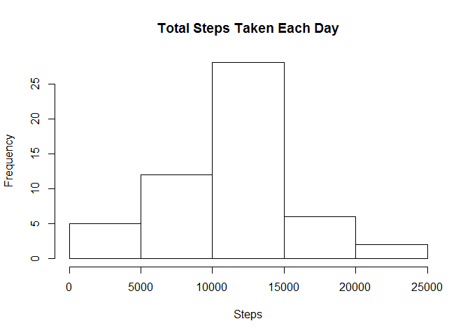
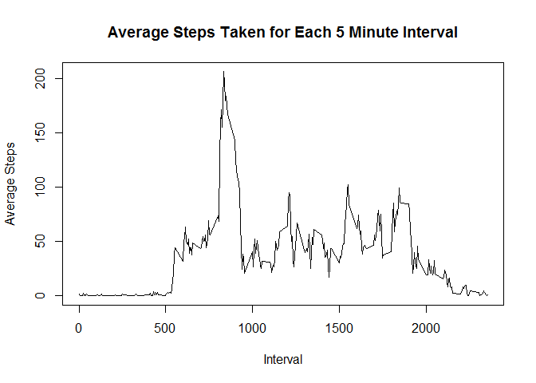
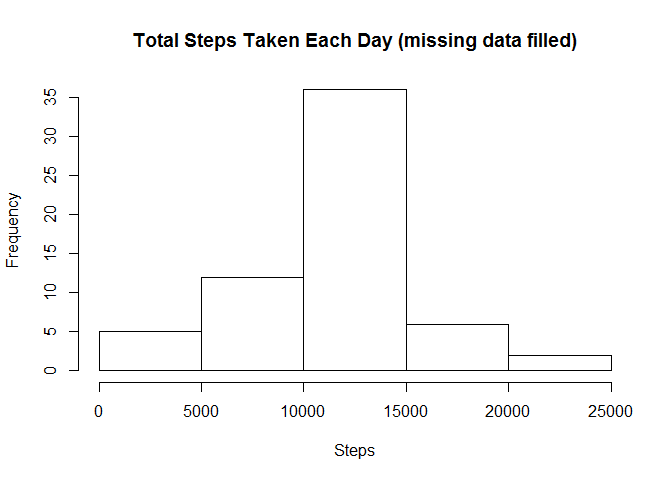
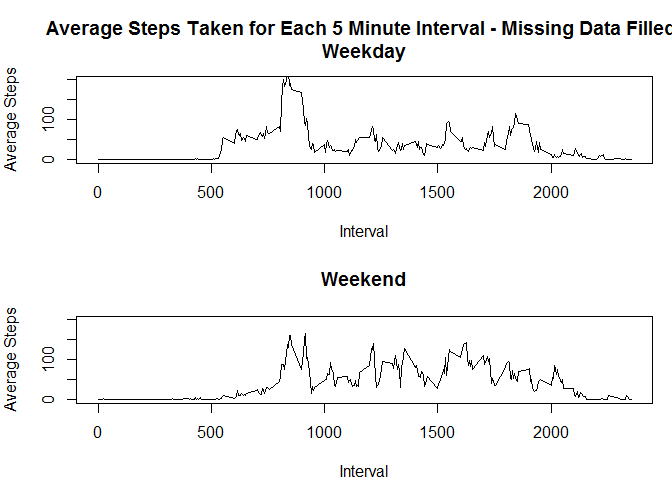

# Reproducible Research: Peer Assessment 1

###Loading and preprocessing the data
We will assume the data file (activity.csv) is in the working directory. The data can be downloaded from https://d396qusza40orc.cloudfront.net/repdata%2Fdata%2Factivity.zip.


```r
data<-read.csv("activity.csv")
```

###What is mean total number of steps taken per day?

####Total number of steps taken per day

```r
stepstot <- aggregate(data$steps, by=list(Date=data$date), FUN=sum)
colnames(stepstot) <- c("Date","Total Steps")
stepstot
```

```
##          Date Total Steps
## 1  2012-10-01          NA
## 2  2012-10-02         126
## 3  2012-10-03       11352
## 4  2012-10-04       12116
## 5  2012-10-05       13294
## 6  2012-10-06       15420
## 7  2012-10-07       11015
## 8  2012-10-08          NA
## 9  2012-10-09       12811
## 10 2012-10-10        9900
## 11 2012-10-11       10304
## 12 2012-10-12       17382
## 13 2012-10-13       12426
## 14 2012-10-14       15098
## 15 2012-10-15       10139
## 16 2012-10-16       15084
## 17 2012-10-17       13452
## 18 2012-10-18       10056
## 19 2012-10-19       11829
## 20 2012-10-20       10395
## 21 2012-10-21        8821
## 22 2012-10-22       13460
## 23 2012-10-23        8918
## 24 2012-10-24        8355
## 25 2012-10-25        2492
## 26 2012-10-26        6778
## 27 2012-10-27       10119
## 28 2012-10-28       11458
## 29 2012-10-29        5018
## 30 2012-10-30        9819
## 31 2012-10-31       15414
## 32 2012-11-01          NA
## 33 2012-11-02       10600
## 34 2012-11-03       10571
## 35 2012-11-04          NA
## 36 2012-11-05       10439
## 37 2012-11-06        8334
## 38 2012-11-07       12883
## 39 2012-11-08        3219
## 40 2012-11-09          NA
## 41 2012-11-10          NA
## 42 2012-11-11       12608
## 43 2012-11-12       10765
## 44 2012-11-13        7336
## 45 2012-11-14          NA
## 46 2012-11-15          41
## 47 2012-11-16        5441
## 48 2012-11-17       14339
## 49 2012-11-18       15110
## 50 2012-11-19        8841
## 51 2012-11-20        4472
## 52 2012-11-21       12787
## 53 2012-11-22       20427
## 54 2012-11-23       21194
## 55 2012-11-24       14478
## 56 2012-11-25       11834
## 57 2012-11-26       11162
## 58 2012-11-27       13646
## 59 2012-11-28       10183
## 60 2012-11-29        7047
## 61 2012-11-30          NA
```

####Histogram of the total number of steps taken each day

```r
hist(stepstot[,2], main="Total Steps Taken Each Day", xlab="Steps")
```

 

####Mean of the total number of steps taken per day

```r
options(scipen=999)
meanstep <- mean(stepstot[,2], na.rm=TRUE)
```

The mean of the total number of steps taken per day is 10766.1886792.

####Median of the total number of steps taken per day

```r
medianstep <- median(stepstot[,2], na.rm=TRUE)
```

The median of the total number os steps takes per day is 10765.

###What is the average daily activity pattern?

####Time series plot of the 5-minute interval (x-axis) and the average number of steps taken, averaged across all days (y-axis)

```r
avg <- aggregate(data$steps, by=list(interval=data$interval), FUN=mean, na.rm=TRUE)

plot(avg$interval, avg$x, type="l", main="Average Steps Taken for Each 5 Minute Interval", xlab="Interval", ylab="Average Steps")
```

 

####Which 5-minute interval, on average across all the days in the dataset, contains the maximum number of steps?


```r
sorted<-avg[order(avg$x,decreasing=TRUE),]
sorted[1,1]
```

```
## [1] 835
```

###Inputting missing values

####Total number of missing values (NAs) in the dataset

```r
sum(is.na(data[,1]))
```

```
## [1] 2304
```

####Devise a strategy for filling in all of the missing values in the dataset and create a new dataset that is equal to the original dataset but with the missing data filled in.

We will be replacing NAs with mean step data for that 5 minute interval. 


```r
#Create data frame with mean steps per interval

avg <- aggregate(data$steps, by=list(interval=data$interval), FUN=mean, na.rm=TRUE)

#Split data into observations with NA and complete cases
NAdata <- subset(data, is.na(data$steps))
compdata<-data[complete.cases(data),]

#Replace step NAs with mean steps for that interval
# Duplicate interval column to be used as replacement column
NAdata2 <- cbind(NAdata, NAdata[,3])
names(NAdata2)<-c("steps", "date", "interval","avgs")

#Replace duplicate interval column data with corresponding mean step data
for(i in avg[,1]){
    
    NAdata2$avgs[NAdata2$avgs==i] <- subset(avg, interval==i, select=x) 
}
NAdata2$avgs<-as.numeric(NAdata2$avgs)
names(NAdata2)<-c("none","date","interval","steps")
fNAdata <- NAdata2[,c(4,2,3)]


#Combine NA and complete data

finaldata <- rbind(compdata, fNAdata)
```

####Make a histogram of the total number of steps taken each day and calculate and report the mean and median total number of steps taken per day. 


```r
stepstotb <- aggregate(finaldata$steps, by=list(Date=finaldata$date), FUN=sum)
colnames(stepstotb) <- c("Date","Total Steps")

hist(stepstotb[,2], main="Total Steps Taken Each Day (missing data filled)", xlab="Steps")
```

 

```r
NAmean <- mean(stepstotb[,2], na.rm=TRUE)
NAmedian <- median(stepstotb[,2], na.rm=TRUE)
```
The mean step total per day ignoring missing values was 10766.1886792.
The mean step total per day replacing missing values with that interval's mean is10766.1886792.


The median step total per day ignoring missing values was 10765.
The median step total per day replacing missing values with that interval's mean is10766.1886792.

*Do these values differ from the estimates from the first part of the assignment? What is the impact of imputing missing data on the estimates of the total daily number of steps?*

The mean value is unchanged, unsurprising as we replaced NAs with mean values. The median value is now equal to the mean. A few days were completely filled with NA values. Once we replaced the NA data that days total steps by definition equalled the mean total steps. This led to multiple mean step total value days, which increased the likelihood that the median would match the mean. 


###Are there differences in activity patterns between weekdays and weekends?

Create a new factor variable in the dataset with two levels - "weekday" and "weekend" indicating whether a given date is a weekday or weekend day.

```r
#Convert date column to date class
finaldata$date<-as.Date(finaldata$date)

#Add column with days of week
finaldata["day"] <- NA
finaldata$day<-weekdays(finaldata$date)

#Convert days of week to Weekend and Weekday
finaldata$day[finaldata$day=="Monday"] <- "Weekday"
finaldata$day[finaldata$day=="Tuesday"] <- "Weekday"
finaldata$day[finaldata$day=="Wednesday"] <- "Weekday"
finaldata$day[finaldata$day=="Thursday"] <- "Weekday"
finaldata$day[finaldata$day=="Friday"] <- "Weekday"
finaldata$day[finaldata$day=="Saturday"] <- "Weekend"
finaldata$day[finaldata$day=="Sunday"] <- "Weekend"

#Convert to day column to factor variable
finaldata$day <- as.factor(finaldata$day)
```

####Panel plot containing a time series plot of the 5-minute interval (x-axis) and the average number of steps taken, averaged across all weekday days or weekend days (y-axis). 


```r
#Split data into Weekday and Weekend
weekend <- subset(finaldata, day=="Weekend")
weekday <- subset(finaldata, day=="Weekday")

##Calculate average steps taken per interval for Weekday and Weekend
dayavg <- aggregate(weekday$steps, by=list(interval=weekday$interval), FUN=mean)
endavg <- aggregate(weekend$steps, by=list(interval=weekend$interval), FUN=mean)


#Plot bot sets

par(mfrow = c(2, 1), mar=c(4,4,4,1))

plot(dayavg$interval, dayavg$x, type="l", main="Average Steps Taken for Each 5 Minute Interval - Missing Data Filled \nWeekday", sub = "Weekday", xlab="Interval", ylab="Average Steps", ylim=c(0,200))

plot(endavg$interval, endavg$x, type="l", main="Weekend", xlab="Interval", ylab="Average Steps", ylim=c(0,200))
```

 
